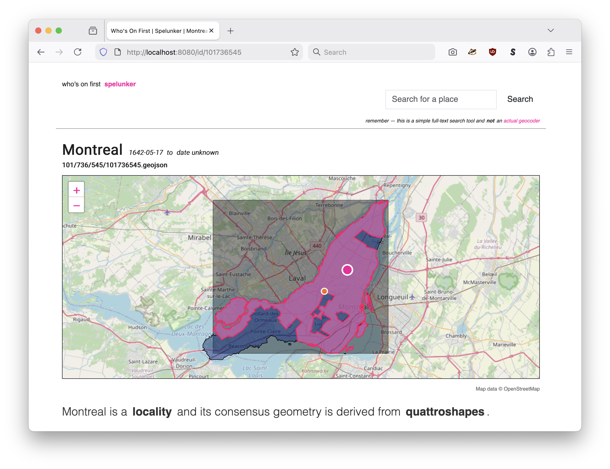

# spelunker

Go package providing a web application, command line tools and a common interface for querying (or "spelunking") an index Who's On First data.

## tl;dr



### Step 1: Index Who's On First data

Index the Who's On First data for Canada reading that data directly from the [whosonfirst-data/whosonfirst-data-admin-ca](https://github.com/whosonfirst-data/whosonfirst-data-admin-ca) repository. Store that index in a SQLite database named `test-git.db`.

```
$> ./bin/wof-spelunker-index sql \
	-iterator-uri git:///tmp \
	-database-uri 'sql://sqlite3?dsn=test-git.db' \
	https://github.com/whosonfirst-data/whosonfirst-data-admin-ca
	
2025/11/18 08:40:06 INFO Iterator stats elapsed=1m0.000177375s seen=0 allocated="31 MB" "total allocated"="133 MB" sys="45 MB" numgc=27
...
2025/11/18 08:43:28 INFO Iterator stats elapsed=4m22.136140208s seen=33845 allocated="8.5 MB" "total allocated"="31 GB" sys="763 MB" numgc=268
```

_Note: You can specify more than one repo to index._

### Step 2: Launch the Spelunker web application

Launch the Spelunker web application for the data stored in the `test-git.db` SQLite database.

```
$> ./bin/wof-spelunker-httpd \
	-spelunker-uri 'sql://sqlite3?dsn=test-git.db'

2025/11/18 08:44:42 INFO Listening for requests address=http://localhost:8080
```

That's it. Point your web browser at `http://localhost:8080` and happy spelunking.

## Documentation

[](https://pkg.go.dev/github.com/whosonfirst/spelunker)

Or run the handy `godoc` Makefile target to launch a local "godoc" browser for this package at `http://localhost:6060`:

```
$> make godoc
godoc -http=:6060
using module mode; GOMOD=/usr/local/whosonfirst/spelunker/go.mod
```

## Tools

### wof-spelunker-index

Index one or more Who's On First data sources in a Spelunker-compatible datastore.

```
$> ./bin/wof-spelunker-index -h
Index one or more Who's On First data sources in a Spelunker-compatible datastore.
Usage: wof-spelunker-index [CMD] [OPTIONS]
Valid commands are:
* opensearch
* sql
```

See [cmd/wof-spelunker-index/README.md](cmd/wof-spelunker-index/README.md) for details (including relevant build tags for specific database implementations).

### wof-spelunker-httpd

Start the Spelunker web application.

```
$> ./bin/wof-spelunker-httpd -h
Start the Spelunker web application.
Usage:
	./bin/wof-spelunker-httpd [options]
Valid options are:
  -authenticator-uri string
    	A valid aaronland/go-http/v3/auth.Authenticator URI. This is future-facing work and can be ignored for now. (default "null://")
  -map-provider string
    	Valid options are: leaflet, protomaps (default "leaflet")
  -map-tile-uri string
    	A valid Leaflet tile layer URI. See documentation for special-case (interpolated tile) URIs. (default "https://tile.openstreetmap.org/{z}/{x}/{y}.png")
  -protomaps-max-data-zoom int
    	The maximum zoom (tile) level for data in a PMTiles database (default 15)
  -protomaps-theme string
    	A valid Protomaps theme label. (default "white")
  -root-url string
    	The root URL for all public-facing URLs and links. If empty then the value of the -server-uri flag will be used.
  -server-uri string
    	A valid `aaronland/go-http/v3/server.Server URI. (default "http://localhost:8080")
  -spelunker-uri string
    	A URI in the form of '{SPELUNKER_SCHEME}://{IMPLEMENTATION_DETAILS}' referencing the underlying Spelunker database. For example: sql://sqlite3?dsn=spelunker.db (default "null://")
  -verbose
    	Enable verbose (debug) logging.	
```

See [cmd/wof-spelunker-httpd/README.md](cmd/wof-spelunker-httpd/README.md) for details (including relevant build tags for specific database implementations).

## Structure

The structure of the Who's On First Spelunker depends on two Go language interfaces: `Spelunker` and `StandardPlacesResult`. These interfaces are defined in this package and the [whosonfirst/go-whosonfirst-spr](https://github.com/whosonfirst/go-whosonfirst-spr) package respectively.

### Spelunker

`Spelunker` is an interface for reading and querying Who's On First style data from an "index" (a database or queryable datafile).

```
type Spelunker interface {
	// Retrieve properties (or more specifically the "document") for...
	GetRecordForId(context.Context, int64, *uri.URIArgs) ([]byte, error)
	// Retrieve the `spr.StandardPlaceResult` instance for a given ID.
	GetSPRForId(context.Context, int64, *uri.URIArgs) (spr.StandardPlacesResult, error)
	// Retrieve the GeoJSON Feature record for a given ID.
	GetFeatureForId(context.Context, int64, *uri.URIArgs) ([]byte, error)
	// Retrieve all the Who's On First record that are a descendant of a specific Who's On First ID.
	GetDescendants(context.Context, pagination.Options, int64, []Filter) (spr.StandardPlacesResults, pagination.Results, error)
	// Retrieve faceted properties for records that are a descendant of a specific Who's On First ID.
	GetDescendantsFaceted(context.Context, int64, []Filter, []*Facet) ([]*Faceting, error)
	// Return the total number of Who's On First records that are a descendant of a specific Who's On First ID.
	CountDescendants(context.Context, int64) (int64, error)
	// Retrieve all the Who's On First records that match a search criteria.
	Search(context.Context, pagination.Options, *SearchOptions, []Filter) (spr.StandardPlacesResults, pagination.Results, error)
	// Retrieve faceted properties for records match a search criteria.
	SearchFaceted(context.Context, *SearchOptions, []Filter, []*Facet) ([]*Faceting, error)
	// Retrieve all the Who's On First records that have been modified with a window of time.
	GetRecent(context.Context, pagination.Options, time.Duration, []Filter) (spr.StandardPlacesResults, pagination.Results, error)
	// Retrieve faceted properties for records that have been modified with a window of time.
	GetRecentFaceted(context.Context, time.Duration, []Filter, []*Facet) ([]*Faceting, error)
	// Retrieve the list of unique placetypes in a Spleunker index.
	GetPlacetypes(context.Context) (*Faceting, error)
	// Retrieve the list of records with a given placetype.
	HasPlacetype(context.Context, pagination.Options, *placetypes.WOFPlacetype, []Filter) (spr.StandardPlacesResults, pagination.Results, error)
	// Retrieve faceted properties for records with a given placetype.
	HasPlacetypeFaceted(context.Context, *placetypes.WOFPlacetype, []Filter, []*Facet) ([]*Faceting, error)
	// Retrieve the list of alternate placetype ("wof:placetype_alt") in a SQLSpelunker database.
	GetAlternatePlacetypes(context.Context) (*Faceting, error)
	// Retrieve the list of Who's On First records with a given alternate placetype ("wof:placetype_alt") in a SQLSpelunker database.
	HasAlternatePlacetype(context.Context, pagination.Options, string, []Filter) (spr.StandardPlacesResults, pagination.Results, error)
	// Retrieve faceted properties for records with a given alternate placetype ("wof:placetype_alt") in a SQLSpelunker database.
	HasAlternatePlacetypeFaceted(context.Context, string, []Filter, []*Facet) ([]*Faceting, error)	
	// Retrieve the list of unique concordances in a Spleunker index.
	GetConcordances(context.Context) (*Faceting, error)
	// Retrieve the list of records with a given concordance.
	HasConcordance(context.Context, pagination.Options, string, string, any, []Filter) (spr.StandardPlacesResults, pagination.Results, error)
	// Retrieve faceted properties for records with a given concordance.
	HasConcordanceFaceted(context.Context, string, string, any, []Filter, []*Facet) ([]*Faceting, error)
	// Retrieve the list of unique tags in a Spelunker index.
	GetTags(context.Context) (*Faceting, error)
	// Retrieve the list of records that have a given tag.
	HasTag(context.Context, pagination.Options, string, []Filter) (spr.StandardPlacesResults, pagination.Results, error)
	// Retrieve faceted properties for records that have a given tag.
	HasTagFaceted(context.Context, string, []Filter, []*Facet) ([]*Faceting, error)
	// Retrieve the list of records that are "visiting Null Island" (have a latitude, longitude value of "0.0, 0.0".
	VisitingNullIsland(context.Context, pagination.Options, []Filter) (spr.StandardPlacesResults, pagination.Results, error)
	// Retrieve faceted properties for records that are "visiting Null Island" (have a latitude, longitude value of "0.0, 0.0".
	VisitingNullIslandFaceted(context.Context, []Filter, []*Facet) ([]*Faceting, error)
}
```

Version "2" of the `Spelunker` interface does NOT define any methods for querying spatial data. Currently that functionality is handled separately by tools and libraries provided by the [whosonfirst/go-whosonfirst-spatial](https://github.com/whosonfirst/go-whosonfirst-spatial) package. Version "3" of the `Spelunker` interface MAY implement the [go-whosonfirst-spatial.SpatialAPI](https://github.com/whosonfirst/go-whosonfirst-spatial/blob/main/spatial.go) but there is still no timeline for when that work might be completed.

### StandardPlacesResult

StandardPlacesResult (SPR) is an interface which defines the minimum set of methods that a system working with a collection of Who's On First (WOF) must implement for any given record. Not all WOF records are the same so the SPR interface is meant to serve as a baseline for common data that describes every record.

The `StandardPlacesResults` return value in many (mosdt) of the `Spelunker` interface methods above is just an array of SPR instances. Currently the Spelunker returns JSON-encoded `StandardPlacesResult` results (specifically JSON-encoded [WOFStandardPlacesResult](https://github.com/whosonfirst/go-whosonfirst-spr/blob/main/whosonfirst.go) structs) but does not _consume_ them. I am considering using the design of the `Spelunker` interface (above) to inform the next version of the `StandardPlacesResult` interface (v3) such that it will expose methods suitable for indexing a Spelunker-compliant database. It's too soon to say for certain but that's what I am thinking.

```
type StandardPlacesResult interface {
	// The unique ID of the place result
	Id() string
	// The unique parent ID of the place result
	ParentId() string
	// The name of the place result
	Name() string
	// The Who's On First placetype of the place result
	Placetype() string
	// The two-letter country code of the place result
	Country() string
	// The (Git) repository name where the source record for the place result is stored.
	Repo() string
	// The relative path for the Who's On First record associated with the place result
	Path() string
	// The fully-qualified URI (URL) for the Who's On First record associated with the place result
	URI() string
	// The EDTF inception date of the place result
	Inception() *edtf.EDTFDate
	// The EDTF cessation date of the place result
	Cessation() *edtf.EDTFDate
	// The latitude for the principal centroid (typically "label") of the place result
	Latitude() float64
	// The longitude for the principal centroid (typically "label") of the place result
	Longitude() float64
	// The minimum latitude of the bounding box of the place result
	MinLatitude() float64
	// The minimum longitude of the bounding box of the place result
	MinLongitude() float64
	// The maximum latitude of the bounding box of the place result
	MaxLatitude() float64
	// The maximum longitude of the bounding box of the place result
	MaxLongitude() float64
	// The Who's On First "existential" flag denoting whether the place result is "current" or not
	IsCurrent() flags.ExistentialFlag
	// The Who's On First "existential" flag denoting whether the place result is "ceased" or not
	IsCeased() flags.ExistentialFlag
	// The Who's On First "existential" flag denoting whether the place result is superseded or not
	IsDeprecated() flags.ExistentialFlag
	// The Who's On First "existential" flag denoting whether the place result has been superseded
	IsSuperseded() flags.ExistentialFlag
	// The Who's On First "existential" flag denoting whether the place result supersedes other records
	IsSuperseding() flags.ExistentialFlag
	// The list of Who's On First IDs that supersede the place result
	SupersededBy() []int64
	// The list of Who's On First IDs that are superseded by the place result
	Supersedes() []int64
	// The list of Who's On First IDs that are ancestors of the place result
	BelongsTo() []int64
	// The Unix timestamp indicating when the place result was last modified
	LastModified() int64
}
```

## Databases

The Who's On First Spelunker attempts to be database agnostic. It does not define or require support for any specific database engine. Instead it works with implementations of the `Spelunker` interface which handle database interactions independent of any specific Spelunker-like application.

As of this writing there is default support for two classes of database engines:

* Anything which supports the Go language `database/sql` interface. In practice this really means SQLite. Support for MySQL and Postgres is available but has not been fully tested and may still contain bugs or gotachas.

* The [OpenSearch](https://opensearch.org/) document store.

### database/sql

New `database/sql`-backed Spelunker instances are created by passing a URI to the `NewSpelunker` method in the form of:

```
sql://{DATABASE_ENGINE}?dsn={DATABASE_ENGINE_DSN}
```

For example:

```
import (
       "context"

       "github.com/whosonfirst/spelunker/v2"
       _ "github.com/whosonfirst/spelunker/v2/sql"       
)

sp, _ := spelunker.NewSpelunker(context.Background(), "sql://sqlite3?dsn=example.db")
```

See [sql/README.md](sql/README.md) for details.

### OpenSearch

New OpenSearch-backed Spelunker instances are created by passing a URI to the `NewSpelunker` method in the form of:

```
opensearch://?client-uri={URL_ESCAPED_GO_WHOSONFIRST_DATABASE_OPENSEARCH_CLIENT_URI}
```

For example:

```
import (
       "context"
       "net/url"
       
       "github.com/whosonfirst/spelunker/v2"
       _ "github.com/whosonfirst/spelunker/v2/opensearch"       
)

client_uri := "opensearch://localhost:9200/spelunker?require-tls=true"
enc_client_uri, _ := url.QueryEscape(client_uri)

sp, _ := spelunker.NewSpelunker(context.Background(), "opensearch://?client_uri=" + enc_client-uri)
```

See [opensearch/README.md](opensearch/README.md) for details, in particular for details about the `client-uri` paramater.

### Implementing a custom database

Implementing support for a custom database involves two steps:

1. Define a Go package implementing the `Spelunker` interface and make sure to call the `RegisterSpelunker` method in your package's `init` function. For a "starter" example consult the [NullSpelunker](spelunker_null.go) implementation.
2. Clone the relevant Spelunker-related tool in the [cmd](cmd) folder and import your custom package. All the Spelunker command-line tools are broken in to two pieces: The guts of the application code live in the [app](app) package which is then invoked in command-line tools exported in the [cmd](cmd) package. The goal is to make extending any given tool possible with a minimum of "time and typing".

For example, this is what the code to extend the HTTP server tool ([cmd/wof-spelunker-httpd](cmd/wof-spelunker-httpd)) to use a custom database implementation would look like:

```
import (
        "context"
        "log"
	
        "github.com/whosonfirst/spelunker/v2/app/httpd/server"
        _ "github.com/YOUR-ORG/spelunker-CUSTOM_DB"	
)

func main() {
        ctx := context.Background()
        server.Run(ctx)
}
```

_Error handling removed for the sake of brevity._

## Motivation

This is a refactoring of both the [whosonfirst/whosonfirst-www-spelunker](https://github.com/whosonfirst/whosonfirst-www-spelunker), [whosonfirst/go-whosonfirst-browser](https://github.com/whosonfirst/go-whosonfirst-browser) and [whosonfirst/go-whosonfirst-spelunker](https://github.com/whosonfirst?q=go-whosonfirst-spelunker&type=all&language=&sort=) packages.

Specifically, the former (`whosonfirst-www-spelunker`) is written in Python and ha a sufficiently complex set of requirements that spinning up a new instance was difficult. By rewriting the spelunker tool in Go the hope is to eliminate or at least minimize these external requirements and to make it easier to deploy the spelunker to "serverless" environments like AWS Lambda or Function URLs. The latter (`go-whosonfirst-browser`) has developed a sufficiently large and complex code base that starting from scratch and simply copying, and adapting, existing functionality seemed easier than trying to refactor everything.

